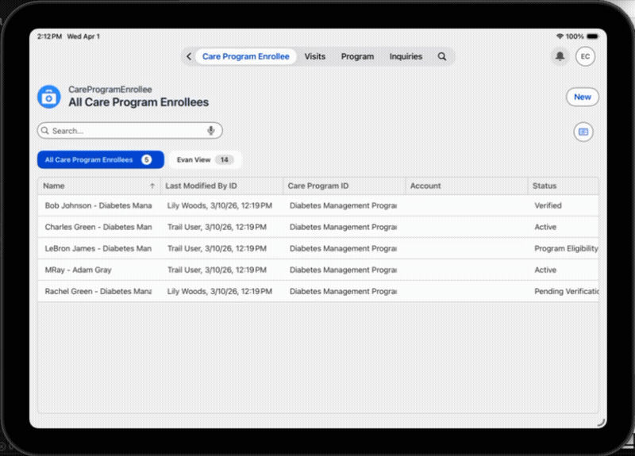
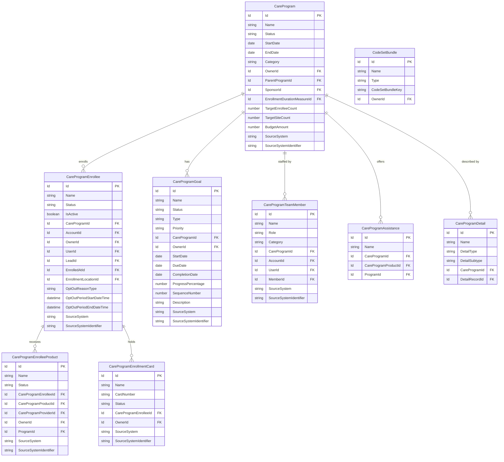

# Care Program Enrollee — Salesforce LSC Mobile Configuration

This project contains the Life Sciences Cloud (LSC) metadata configuration for offline sync of the **Care Program Enrollee** data model.

## Data Model

📖 [Care Program Data Model — Salesforce LSC Developer Guide](https://developer.salesforce.com/docs/atlas.en-us.life_sciences_dev_guide.meta/life_sciences_dev_guide/hc_care_program_data_model.htm)

---

## DbSchema Records

Each `LifeSciConfigRecord` of category `DbSchema` defines which Salesforce object is synced offline and which fields are included in the local SQLite database on the mobile device.

All records are assigned to the **Field Sales Representative** profile.

| DbSchema Record | SObject | Synced Fields |
|---|---|---|
| `DbSchema_CareProgram` | `CareProgram` | Id, Name, Status, StartDate, EndDate, Category, OwnerId, SponsorId, ParentProgramId, TargetEnrolleeCount, TargetSiteCount, BudgetAmount, EnrollmentRate, ActiveSiteCount, CurrentEnrolleeCount, SourceSystem, SourceSystemIdentifier + audit fields |
| `DbSchema_CareProgramEnrollee` | `CareProgramEnrollee` | Id, Name, Status, IsActive, CareProgramId, AccountId, OwnerId, UserId, LeadId, EnrolledAtId, EnrollmentLocationId, OptOut fields, SourceSystem + audit fields |
| `DbSchema_CareProgramEnrolleeProduct` | `CareProgramEnrolleeProduct` | Id, Name, Status, CareProgramEnrolleeId, CareProgramProductId, CareProgramProviderId, OwnerId, ProgramId, SourceSystem + audit fields |
| `DbSchema_CareProgramEnrollmentCard` | `CareProgramEnrollmentCard` | Id, Name, CardNumber, Status, CareProgramEnrolleeId, OwnerId, SourceSystem + audit fields |
| `DbSchema_CareProgramGoal` | `CareProgramGoal` | Id, Name, Status, Type, Priority, CareProgramId, OwnerId, StartDate, DueDate, CompletionDate, ProgressPercentage, SequenceNumber, SourceSystem + audit fields |
| `DbSchema_CareProgramTeamMember` | `CareProgramTeamMember` | Id, Name, Role, Category, CareProgramId, AccountId, UserId, MemberId, SourceSystem + audit fields |
| `DbSchema_CareProgramAssistance` | `CareProgramAssistance` | Id, Name, CareProgramId, CareProgramProductId, ProgramId + audit fields |
| `DbSchema_CareProgramDetail` | `CareProgramDetail` | Id, Name, DetailType, DetailSubtype, CareProgramId, DetailRecordId + audit fields |
| `DbSchema_CodeSetBundle` | `CodeSetBundle` | Id, Name, Type, CodeSetBundleKey, OwnerId + audit fields *(dependency for CareProgramDetail)* |

### Audit Fields (common to all records)
`CreatedDate`, `CreatedById`, `LastModifiedDate`, `LastModifiedById`, `IsDeleted`, `CurrencyIsoCode`

### UserRecordAccess Fields (objects with OwnerId)
`UserRecordAccess.HasReadAccess`, `UserRecordAccess.HasEditAccess`, `UserRecordAccess.HasDeleteAccess`, `UserRecordAccess.HasAllAccess`, `UserRecordAccess.MaxAccessLevel`

---

## Profile Permissions

The `Field Sales Representative` profile has been granted **Read + Create** on all Care Program objects:

| Object | Read | Create |
|---|---|---|
| `CareProgram` | ✅ | ✅ |
| `CareProgramAssistance` | ✅ | ✅ |
| `CareProgramDetail` | ✅ | ✅ |
| `CareProgramEnrollee` | ✅ | ✅ |
| `CareProgramEnrolleeProduct` | ✅ | ✅ |
| `CareProgramEnrollmentCard` | ✅ | ✅ |
| `CareProgramGoal` | ✅ | ✅ |
| `CareProgramTeamMember` | ✅ | ✅ |
| `CodeSetBundle` *(dependency)* | ✅ | — |

Tab visibility for `CareProgramEnrollee` is set to **Default On**.

---

## Limitations

- **Path Component (Chevrons):** The standard Salesforce Path component is not supported on the AFLS mobile app. Use the AFLS **Workflow StagePath** functionality instead.
- **OmniStudio FlexCards:** FlexCards are not currently supported on AFLS mobile. Any UI using FlexCards will need to be swapped out for supported components.
